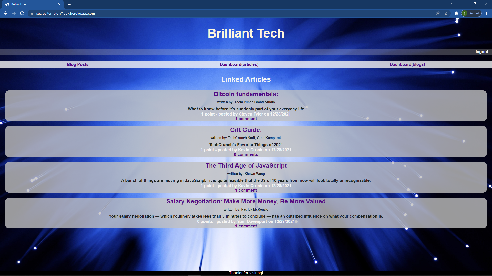

# keep-up-programming   

Keep up with recent trends in programming by reading fellow developers' blog posts and linked articles. Create blogs and link articles of your own. (bootcamp challenge)

## Table of Contents
* [Description](#description)
* [Installation](#installation)
* [Usage](#usage)
* [License](#license)
* [References](#reference)
* [Contributing](#contributing)
* [Tests](#tests)
* [Questions](#questions)

## Description 
_***Built With:***_ JavaScript,HTML,CSS,ES6,Bootstrap,Node  
This is my first official full stack project. I tried to do a little too much with it, and I ended up not making the deadline. This is disappointing, but I have definitely learned a great deal, and I'm basically happy with the final project. It is a tech blog in which a user is able to link articles and post blogs. They can also view blogs and links, upvote them, and comment on them. The user is able to create an account and then log in to access the features of the site. The user session is tracked with express sessions which will time out the session after 30 minutes. The site is built with an MVC structure, using sequelize and handlebars.js. The database is mysql. There are some areas I would like to come back to and improve. I would like to have the session end after a period of inactivity, not just 30 minutes. I would like to communicate better with the user when events occur, such as log in, log out, invalid password etc... Also, I would like for the user to be able to delete their account if they choose.

## Installation 
click on the deployed link and follow the prompts.

## Usage 
see above

[Deployed Application](https://secret-temple-71857.herokuapp.com)

## License 
[CC](https://creativecommons.org/licenses/by/4.0/)

## References 
None

## Questions 
Contact: Sam Davenport  
https://github.com/steadysamwise4  
samueldavenport@att.net
    

